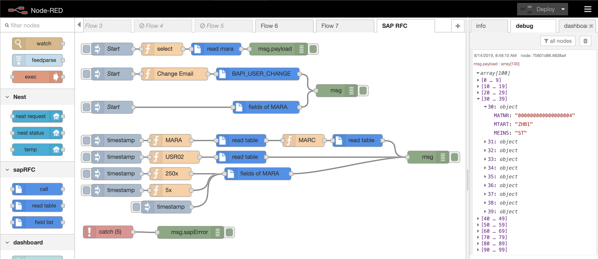

# IoT Air Quality System

    
    

- The objective of this project is to read the Temperature, Humidity and Nocive gases concentration in PPM of a ambient and then display it on a dashboard

## Shortcuts

- [Choices](#choises)
    - [Board](#board)
    - [Temperature and Humidity Sensor](#temperature-and-humidity-sensor)
    - [Nocive Gases Sensor](#nocive-gases-sensor)
    - [Helpfull to Have](#helpfull-to-have)
- [Software](#software)
    - [Simulator](#simulator)
    - [MQTT Broker](#mqtt-broker)
    - [DashBoard](#dashboard-client)
- [Code](#code)
- [My Project](#my-project)

## Choises 

- [Board](#board)
- [Temperature and Humidity Sensor](#temperature-and-humidity-sensor)
- [Nocive Gases Sensor](#nocive-gases-sensor)
- [Helpfull to Have](#helpfull-to-have)

### Board

    

 

- The ESP32 is a great choice for IoT projects, especially for beginners, because it’s easy to use and packed with useful features. It has built-in Wi-Fi and Bluetooth, so you can connect your devices to the internet or communicate with other devices without needing extra hardware. This makes it perfect for creating smart systems like weather stations, home automation, or monitoring devices.

- One reason to choose the ESP32 is that it supports MicroPython, a simple programming language that’s easy to learn. Unlike more complicated languages, MicroPython lets you write and test your code quickly, even if you’re new to programming. This is a big advantage for beginners or hobbyists who want to focus on making their projects work rather than spending a lot of time learning complex coding.

- The ESP32 is also affordable and widely available, which means you don’t need to spend a lot of money to get started. It works well with many sensors and other components, so you can create a wide range of projects without running into compatibility problems. Plus, there are plenty of online guides and community support to help you learn and solve issues as you go.

- Overall, the ESP32 is a smart choice because it’s powerful, simple to program, and cost-effective, making it an excellent option for anyone wanting to explore IoT projects.

- [Esp32 Devkit v1](https://www.amazon.com.br/M%C3%B3dulo-WiFi-ESP32-Bluetooth-pinos/dp/B0BSVFG762/ref=sr_1_3?__mk_pt_BR=%C3%85M%C3%85%C5%BD%C3%95%C3%91&crid=WMWMTC1JIUQU&dib=eyJ2IjoiMSJ9.WH80v_Y2VHjWaRhQytjX1y3mkqjBqMul7lnmNVfnQ2eNoGg7fKOrN-LggpWsD6ocbSDMR6IAs_aoVEG6huI7E-zrGmdtMNbtJrPl_6fNB8FhrcG7xYbQd-4rM-xePVlwVJfKUKlGlbPqEMuhCv3JbKc6k6Nvt9Z0W6ork_Tw_WsZKbECHX8fCOyVNKQ76c9KN7NDoMHbYsB_MeAaTAEbTzlRbOu7CmolssTtWibh19EiWYG0evMUFFvcS2t80-Vitb19K66JE__tSJCktODvGNCUaROma-XVyFL8TIBOqKk.NbchqtMsr2AJ6xpofmZTCoJ6Ggbu_cvc6BnaehqGZMQ&dib_tag=se&keywords=esp32+30+pinos&qid=1732003186&sprefix=esp32+30+pinos%2Caps%2C182&sr=8-3&ufe=app_do%3Aamzn1.fos.6d798eae-cadf-45de-946a-f477d47705b9)

### Temperature and Humidity Sensor

    

 

- The DHT22 was chosen instead of teh DHT11 for the greater accuracy, wider range of measurements, long-term reliability, faster data updates.
- There are othere options on tha market, however none as cost effective as the DHT22
- [DHT22](https://www.amazon.com.br/Sensor-Temperatura-DHT22-Para-Arduino/dp/B09VX6D8YR/ref=sr_1_3?__mk_pt_BR=%C3%85M%C3%85%C5%BD%C3%95%C3%91&crid=6ZXQIZ1TACUT&dib=eyJ2IjoiMSJ9.XqUREXNGu55KhFT2Gwjfe3W4qIGI5ih-Drr0dUvO6R0cvGh-F2eXixOdUYPSdLuyr6HN_HAuLAz6IIeXOWo91Q_AmDdMDR-fRB8Mg2KslChQ1H1VYKYHw9oFEwdNB4h_z1OnHwhsiCF3uYAYCQMIGjukyLqtS2VbxbN2D3_GfdUet8dTcbJq86qD3O-WdF9VPRP9MTN5AsBjqfC7M568CQn27gp2DAc55epuD9Lat_xqMQKxD2QknSzCQWiLWP9dORlCNBjoMCZumc9P_aIZwqtnYNks6tMgx6Rx3phc0K4.ri61FLrd1c1bFPLHWGWMS6fXidR54PbFCUUBpIo13yk&dib_tag=se&keywords=dht22&qid=1732003940&sprefix=dht22%2Caps%2C260&sr=8-3&ufe=app_do%3Aamzn1.fos.6d798eae-cadf-45de-946a-f477d47705b9)

### Nocive Gases Sensor

    

 

- The MQ135 gas sensor is a cost-effective and versatile choice for air quality monitoring projects. It can detect various gases, including ammonia, nitrogen oxides, benzene, alcohol, smoke, and carbon dioxide, making it suitable for environments with multiple pollutants. Its wide detection range (10 ppm to 1000 ppm) and compatibility with microcontrollers like Arduino and ESP32 ensure easy integration. The sensor is adjustable for specific applications via a built-in potentiometer and operates reliably across a broad temperature and humidity range. While it’s excellent for detecting trends in air quality, it requires calibration for accurate readings and cannot distinguish between gases without additional processing. Overall, the MQ135 is ideal for projects focused on identifying relative changes in air quality rather than precise measurements. 

- [MQ135](https://www.amazon.com.br/Gen%C3%A9rico-Sensor-Mq-135-Am%C3%B4nia-N%C3%ADtrico/dp/B0D8ZKWRBY/ref=sr_1_1?__mk_pt_BR=%C3%85M%C3%85%C5%BD%C3%95%C3%91&crid=SZ4QNRP2VRU&dib=eyJ2IjoiMSJ9.jWrrco8X1EbOx2C_0oIKpdsQfCh7r8AilE6GyJwG5LvswEzx5TpY1V9SrsXlT5PbPIryguJ3oadWdDtpxDTOSRVF2-TrxmIy0FiJnOh7fj4.7hcq-G-3Bc2T1p7zIVlmLX4jlk8JNRkUpuvRTjDxyAw&dib_tag=se&keywords=mq135&qid=1732004354&sprefix=mq135%2Caps%2C239&sr=8-1)

### Relay

    

 

- For the Relay was used a board with 8 channels, not for necessity, but only becuase I already had this board available.
- [Relay 1 Channel](https://www.amazon.com.br/Gen%C3%A9rico-M%C3%B3dulo-Relay-Ky-019-Arduino/dp/B0DF6PL41J/ref=sr_1_3?__mk_pt_BR=%C3%85M%C3%85%C5%BD%C3%95%C3%91&crid=G4RJLY3WOR5B&dib=eyJ2IjoiMSJ9.JAxgBTsVUdFfq3MhGHKl7DnqWCRbmmBv1yVbj5hIc4FSuz4KQXrDIEgae3l74J4fwXT0lPdWYrspoQDv3GuRIpnHOv8eJ4oKOHY9nK02qejr-9XSUL3feSnT7q_xT39EeJjwjLAPQsfWL5ex_ftlvw8RjW_HeMJeY3JsNh5avzJDIij9-Hnp8Er3rlxOzHWelyoK_H_Ey5u4KdZz2MnKwh2CsTOZBbKdPenQWlBYMjpkXZ_4CVbmFE6QcA0IEtplYTOY9v8VmHhbGiAt3fGSqWdc1yTma6ybJJeDuzxWCJg.yWP2xo3iHdGbV9uQuIpKNfyAk07FvGi7r6eQ0KZTWTU&dib_tag=se&keywords=relay&qid=1732005207&sprefix=realay%2Caps%2C229&sr=8-3)
- [Relay 8 Channels](https://www.amazon.com.br/M%C3%B3dulo-Rel%C3%A9-Canais-para-Arduino/dp/B0C9L8BWF3/ref=sr_1_10?__mk_pt_BR=%C3%85M%C3%85%C5%BD%C3%95%C3%91&crid=ETOKOQUSVZBU&dib=eyJ2IjoiMSJ9.YhjXiMFXjLcqgQ3ts9k5yKj24MsN4ax5E7Sp6Haq6Uu1oPne_cPDkYAl-KdLNf7wzRWe5e1WveWYMae6bnoFe2nOMOpfbIg2zUjKXpKsFoIhuKsftKq5lcmT5BAcpowmOvTvDly-2BmeH9gBS7YAWrwo1Oe-uNL-iz0o_9GeYArnvLtukItDT0UpAgM0mAR9xxWsy8IdNJcH8cZZnvRvyxjel0ZXXClLXshbUmtQTv2L-xHHjkgQeilygRxLH0ZPIAc7KsCVJKFqEMJbvhYPeh9Fyil7G5WjT9i8JkOBrII.CbtxNNF62WwECbj7AJ_EGvZhXr4HQZsZXGTOSzezC2Q&dib_tag=se&keywords=8+channel+relay&qid=1732005114&sprefix=8+channel+relay%2Caps%2C223&sr=8-10&ufe=app_do%3Aamzn1.fos.6d798eae-cadf-45de-946a-f477d47705b9)

### Helpfull to have
- It's helpfull to have some tools to make it work properly without much strain as a **BreadBoard**, **Jumpers**, **Arduino Power Supply Board**, **127v 10A Outlet** both **IN** and **OUT**

## Software

### Simulator
- The simulator used was the [Wokwi](https://wokwi.com/)
- [My Simulation](https://wokwi.com/projects/414556267782153217)
    - Note that in order to use this as a actual project you would need to change the Wifi ssid and the Password, as well as the MQTT Broker
- This simulator make it possible to connect to actual Wifi and MQTT Broker and using this configuration you can display the data using Node-Red on your local machine changing the inputs from the sensor.
- Note that the sensor MQ135 does not have a image, for it's a custom chip, just copy the **mq135.chip.json** and the **mq135.chip.c** files

    
    >

 

    
    >

### IDE
- The are quite a few options, however **VSCode** *Pymakr* extenssion is a good idea to develop in micropython, given all the facilities the IDE already provides for the user
[Pymaker](https://docs.pycom.io/pybytes/pymakr-online/)

- Another possibility is the **Thonny IDE** it uses esptool to manage data in the ESP32 and is simple to install and use
[Thonnty IDE](https://thonny.org/)

### MQTT Broker

- [Mosquitto Broker](https://mosquitto.org/)
- The choice for this project was the mosquitto for it's easy to install and simple to use, that is, if you are somewhat familiarized with the command line
- After installation you would need to start it, I always use the flag `-v` while developing to see the infomation flow
    - `mosquitto -v`
- Sometimes for development some configuration would be necessary to the *mosquitto.conf* file.
    - `listener 1883`
    - `allow_anonymous true`
    - Then you would need to start the broker with the custom chantes:
        - `mosquitto -c <path/to/mosquitto.conf> -v`
- To see the actual data it's possible to use:
    - `mosquitto_sub -h <host> -p 1883 -t <topic>`
- However the [MQTTX](https://mqttx.app/) provides a solution with a more suitable UI and UX with a dashboard were you can listen to topics in brokers:

    

### DashBoard (Client)
- The choice for the dashboard (client), was the [Node-Red](https://nodered.org/) given the simplicity of the of the software, giving a low code apprach for the builder to use.

    

 

    
    >

## Code
- [Source Code](https://github.com/FelipeGuerra5/iot-micropython-air-quality/blob/main/main.py)

- The idea was to make it simple to undestand and organized. The code counts with the `main()` function that actually runds the loop necessary for it's constant measurements. Before the main funcition there are several other functions with very descriptive names, each for one sensor, relay, or input to the user.

## My Project

    

 

    

 

    

 

    

 

    

 

    

- [Flow Json](https://github.com/FelipeGuerra5/iot-micropython-air-quality/blob/main/flows.json)

 
 

# Sistema de Qualidade do Ar IoT
- Esse projeto tem como objetivo monitorar a qualidade do ar, controlando ventilação com base na concentração de gases e temperatura. Através de um painel web simples, você consegue visualizar em tempo real os valores coletados pelos sensores DHT22 e MQ135. O ESP32, ao conectar-se ao Wi-Fi e enviar dados para um broker MQTT, facilita a transmissão de dados para o painel.

## Atalhos

- [Escolhas](#escolhas)
    - [Placa](#placa)
    - [Sensor de Temperatura e Umidade](#sensor-de-temperatura-e-umidade)
    - [Sensor de Gases Nocivos](#sensor-de-gases-nocivos)
    - [Útil de Ter](#útil-de-ter)
- [Software](#software-1)
    - [Simulador](#simulador)
    - [Broker MQTT](#broker-mqtt)
    - [Painel](#painel)
- [Código](#código)
- [Meu Projeto](#meu-projeto)

## Escolhas 

- [Placa](#placa)
- [Sensor de Temperatura e Umidade](#sensor-de-temperatura-e-umidade)
- [Sensor de Gases Nocivos](#sensor-de-gases-nocivos)
- [Útil de Ter](#útil-de-ter)

### Placa

    

 

- O ESP32 é uma excelente escolha para projetos IoT, especialmente para iniciantes, porque é fácil de usar e possui recursos úteis. Ele tem Wi-Fi e Bluetooth integrados, permitindo que você conecte seus dispositivos à internet ou se comunique com outros dispositivos sem precisar de hardware adicional. Isso o torna perfeito para criar sistemas inteligentes, como estações meteorológicas, automação residencial ou dispositivos de monitoramento.

- Um dos motivos para escolher o ESP32 é que ele suporta o MicroPython, uma linguagem de programação simples e fácil de aprender. Ao contrário de linguagens mais complicadas, o MicroPython permite escrever e testar seu código rapidamente, mesmo se você for iniciante em programação. Isso é uma grande vantagem para iniciantes ou hobbyistas que querem se concentrar em fazer seus projetos funcionarem, ao invés de gastar muito tempo aprendendo linguagens complexas.

- O ESP32 também é acessível e amplamente disponível, o que significa que você não precisa gastar muito dinheiro para começar. Ele funciona bem com muitos sensores e outros componentes, permitindo criar uma grande variedade de projetos sem problemas de compatibilidade. Além disso, há muitos guias online e suporte da comunidade para ajudar você a aprender e resolver problemas ao longo do caminho.

- No geral, o ESP32 é uma escolha inteligente porque é poderoso, simples de programar e econômico, tornando-o uma excelente opção para quem deseja explorar projetos IoT.

- [Esp32 Devkit v1](https://www.amazon.com.br/M%C3%B3dulo-WiFi-ESP32-Bluetooth-pinos/dp/B0BSVFG762/ref=sr_1_3?__mk_pt_BR=%C3%85M%C3%85%C5%BD%C3%95%C3%91&crid=WMWMTC1JIUQU&dib=eyJ2IjoiMSJ9.WH80v_Y2VHjWaRhQytjX1y3mkqjBqMul7lnmNVfnQ2eNoGg7fKOrN-LggpWsD6ocbSDMR6IAs_aoVEG6huI7E-zrGmdtMNbtJrPl_6fNB8FhrcG7xYbQd-4rM-xePVlwVJfKUKlGlbPqEMuhCv3JbKc6k6Nvt9Z0W6ork_Tw_WsZKbECHX8fCOyVNKQ76c9KN7NDoMHbYsB_MeAaTAEbTzlRbOu7CmolssTtWibh19EiWYG0evMUFFvcS2t80-Vitb19K66JE__tSJCktODvGNCUaROma-XVyFL8TIBOqKk.NbchqtMsr2AJ6xpofmZTCoJ6Ggbu_cvc6BnaehqGZMQ&dib_tag=se&keywords=esp32+30+pinos&qid=1732003186&sprefix=esp32+30+pinos%2Caps%2C182&sr=8-3&ufe=app_do%3Aamzn1.fos.6d798eae-cadf-45de-946a-f477d47705b9)

### Sensor de Temperatura e Umidade

    

 

- O DHT22 foi escolhido em vez do DHT11 devido à maior precisão, maior faixa de medições, confiabilidade a longo prazo e atualizações de dados mais rápidas.
- Existem outras opções no mercado, porém nenhuma tão custo-efetiva quanto o DHT22.
- [DHT22](https://www.amazon.com.br/Sensor-Temperatura-DHT22-Para-Arduino/dp/B09VX6D8YR/ref=sr_1_3?__mk_pt_BR=%C3%85M%C3%85%C5%BD%C3%95%C3%91&crid=6ZXQIZ1TACUT&dib=eyJ2IjoiMSJ9.XqUREXNGu55KhFT2Gwjfe3W4qIGI5ih-Drr0dUvO6R0cvGh-F2eXixOdUYPSdLuyr6HN_HAuLAz6IIeXOWo91Q_AmDdMDR-fRB8Mg2KslChQ1H1VYKYHw9oFEwdNB4h_z1OnHwhsiCF3uYAYCQMIGjukyLqtS2VbxbN2D3_GfdUet8dTcbJq86qD3O-WdF9VPRP9MTN5AsBjqfC7M568CQn27gp2DAc55epuD9Lat_xqMQKxD2QknSzCQWiLWP9dORlCNBjoMCZumc9P_aIZwqtnYNks6tMgx6Rx3phc0K4.ri61FLrd1c1bFPLHWGWMS6fXidR54PbFCUUBpIo13yk&dib_tag=se&keywords=dht22&qid=1732003940&sprefix=dht22%2Caps%2C260&sr=8-3&ufe=app_do%3Aamzn1.fos.6d798eae-cadf-45de-946a-f477d47705b9)

### Sensor de Gases Nocivos

    

 

- O sensor de gás MQ135 é uma opção custo-efetiva e versátil para projetos de monitoramento de qualidade do ar. Ele pode detectar vários gases, incluindo amônia, óxidos de nitrogênio, benzeno, álcool, fumaça e dióxido de carbono, tornando-o adequado para ambientes com múltiplos poluentes. Sua ampla faixa de detecção (10 ppm a 1000 ppm) e compatibilidade com microcontroladores como Arduino e ESP32 garantem fácil integração. O sensor é ajustável para aplicações específicas via um potenciômetro embutido e opera de maneira confiável em uma ampla faixa de temperatura e umidade. Embora seja excelente para detectar tendências na qualidade do ar, ele requer calibração para leituras precisas e não pode distinguir entre os gases sem processamento adicional. No geral, o MQ135 é ideal para projetos focados em identificar mudanças relativas na qualidade do ar, em vez de medições precisas.

- [MQ135](https://www.amazon.com.br/Gen%C3%A9rico-Sensor-Mq-135-Am%C3%B4nia-N%C3%ADtrico/dp/B0D8ZKWRBY/ref=sr_1_1?__mk_pt_BR=%C3%85M%C3%85%C5%BD%C3%95%C3%91&crid=SZ4QNRP2VRU&dib=eyJ2IjoiMSJ9.jWrrco8X1EbOx2C_0oIKpdsQfCh7r8AilE6GyJwG5LvswEzx5TpY1V9SrsXlT5PbPIryguJ3oadWdDtpxDTOSRVF2-TrxmIy0FiJnOh7fj4.7hcq-G-3Bc2T1p7zIVlmLX4jlk8JNRkUpuvRTjDxyAw&dib_tag=se&keywords=mq135&qid=1732004354&sprefix=mq135%2Caps%2C239&sr=8-1)

### Relé

    

 

- O relé de 5V de 2 canais foi escolhido para controlar dispositivos externos, como um ventilador ou sistema de ventilação, em resposta a medições de qualidade do ar. Ao conectar o ESP32 ao relé, você pode programar a ação do ventilador ou de outros dispositivos com base na leitura do sensor de gás.
- [Relé](https://www.amazon.com.br/Modulo-Relé-5V-2-canais-Arduino/dp/B0714NG9P6/ref=sr_1_2?__mk_pt_BR=%C3%85M%C3%85%C5%BD%C3%95%C3%91&crid=2VRS5D37UI6&dib=eyJ2IjoiMSJ9.ychXFL6g0QnY7eJxyNxH9vN5_h0yy33yNS2j54n8E-lQ20_CJZQyrAh4nVqqj2y2XKcz25zHYXzp4M8y1fdtl-7sGZOLJ9KL1mG4WRA0b0giEzYtoS4KrWsPzVg6EM5Z4QYrdeJkH-dfj5CgMb_SyM2dp46m9gjOh1fB_wE1eL0cUoZCkivsz37CUzmrVXXLxH_Hz-fT2ZqWKLhO8ws6IX3ThrlV8Jd61lMhf8_vNNj6fVYdpckb7Z6Ij1NJ9Rt1gRI5jwVSqOZQfc_lJmREPH0l_eAjEyJzWce69n0zv6b_.FFM7llzTq-XUPUZXkzHD7GleXknRfIc4VuYo67o6izY&dib_tag=se&keywords=rele+5v&qid=1732004573&sprefix=rele+5v%2Caps%2C219&sr=8-2)

### Útil de Ter
- É útil ter algumas ferramentas para fazer funcionar corretamente sem muito esforço, como uma **BreadBoard**,**Jumpers**, Placa de **Fonte de Alimentação** Arduino, e **tomada de 127v 10A** tanto **Fêmea** quanto para **Macho**

## Software

- [Simulador](#simulador)
- [Broker MQTT](#broker-mqtt)
- [Painel](#painel)

### Simulador
- No momento, você pode utilizar plataformas como [Wokwi](https://wokwi.com/) para testar a parte do código em que usa sensores e componentes. Você consegue realizar a simulação do código com componentes como o DHT22 e MQ135.
 
### Broker MQTT

- [Mosquitto Broker](https://mosquitto.org/)
- A escolha para este projeto foi o Mosquitto pela sua facilidade de instalação e simplicidade de uso, ou seja, se você estiver um pouco familiarizado com a linha de comando.
- Após a instalação, você precisará iniciá-lo. Eu sempre uso a flag `-v` enquanto desenvolvo para ver o fluxo de informações.
    - `mosquitto -v`
- Às vezes, para desenvolvimento, pode ser necessário configurar o arquivo *mosquitto.conf*.
    - `listener 1883`
    - `allow_anonymous true`
    - Então, você precisaria iniciar o broker com as alterações personalizadas:
        - `mosquitto -c <path/to/mosquitto.conf> -v`
- Para ver os dados reais, é possível usar:
    - `mosquitto_sub -h <host> -p 1883 -t <topic>`
- No entanto, o [MQTTX](https://mqttx.app/) fornece uma solução com uma interface e experiência de usuário mais adequadas, com um painel onde você pode ouvir tópicos em brokers

### Painel
- A escolha para o painel (cliente) foi o [Node-Red](https://nodered.org/) devido à simplicidade do software, oferecendo uma abordagem de baixo código para o desenvolvedor usar

    

 

    
    >

## Código
- [Código Fonte](https://github.com/FelipeGuerra5/iot-micropython-air-quality/blob/main/main.py)

- A ideia foi torná-lo simples de entender e organizado. O código conta com a função `main()`, que na verdade executa o loop necessário para as medições constantes. Antes da função principal, existem várias outras funções com nomes bem descritivos, cada uma para um sensor, relé ou entrada do usuário.

## Meu Projeto

Esse projeto tem como objetivo monitorar a qualidade do ar, controlando ventilação com base na concentração de gases e temperatura. Através de um painel web simples, você consegue visualizar em tempo real os valores coletados pelos sensores DHT22 e MQ135. O ESP32, ao conectar-se ao Wi-Fi e enviar dados para um broker MQTT, facilita a transmissão de dados para o painel.

